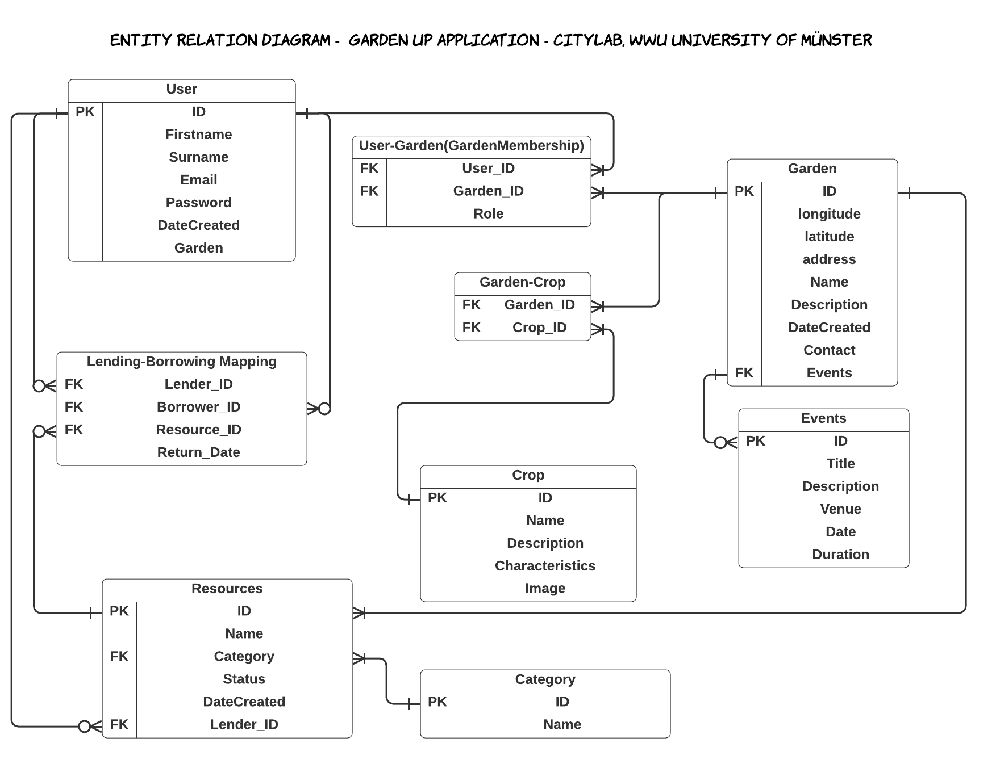

# Garden Up Backend Repository
This is the backend of the whole City Lab project at IFGI - University of Münster. The project was carried out by Brian Pondi, Javier Martin, Jonas Hurst, Nivedita Vee & Lukas Bäcker in Winter 2021/2022. 
The main purpose was to build an application that leads to the following benefits of urban gardening:
- Community collaboration
- Breaking social barriers
- Sustainability 
- Educate about produce 
- Healthy lifestyle


The Software achitecture overview is shown in the diagram below : 


The frontend codebase of this application can be found at:
- https://github.com/LukasBaecker/fe-stadtlabor-studyproject 

The Database Entity Relationship Diagram overview is shown in the diagram below : 



The backend part of the application was developed was developed in a Domain Driven Design and we can split it into :
- User Service
- Garden Service
- Resource Service
- Event Service
- Crop Service


## User Service 

User service data is stored in a Postgres instance. The service uses JWT for authentication. Users can be an Admin or a Member(s) of a Garden(s) Community(ies) . The passwords are stored in the Database encrypited using Secure Hash Algorithm(SHA-256).

Capabilities of the User service include apis to do the following :

- User Sign up
- User Log in and Log out
- User Forgot Password
- User Reset Password
- Get User details
- Update User details
- Find Gardens List that a User is part of

## Garden Service 

Garden Service data is also stored in Postgres. The service uses JWT for authentication and deals with the creation of gardens in the app and management of their details. Details such as name, location, description, address, and crops, among others can be assigned and edit to every garden.  

Capabilities of the Garden service include apis to do the following :

- Get details of all gardens in our application
- Get the details of a particular garden based on the id
- Post a new garden into the application
- Delete a garden from the application
- Update the details of a garden
- Get nearest gardens based on user location 

## Resource Service

Resource Service data is stored in Postgres. The service uses JWT for authentication and deals with the creation and assignation of a type of resource (tool, seeds, fertilizers etc.) to a particular garden. The resources could be set up as available for borrowing, borrowed or available for donation.  

Capabilities of the Garden service include apis to do the following :

- Get all resources in our application
- Get a particular resource based on its id
- Post a new resource into the application and assign it to a garden
- Delete a resource from the application
- Update a particular resource

## Event Service

Event Service data is also stored in Postgres. The service uses JWT for authentication. The service deals with the events which have taken place already and also the ones which are about to happen in the gardens of our application located in Muenster. 

Capabilities of the Event service include apis to do the following :

- Get all the events of our application
- Get a particular event based on the event id
- Post an event to the application
- Delete an event from the application
- Update the details for the events


## Crop Service
Crop Service data is stored in Postgres. The service uses JWT for authentication. The service includes details such as the name, description and some characteristics for the local crop varieties of Muenster, along with their pictures.

Capabilities of the Crop service include apis to do the following :

- Get all the crops of our application
- Update the details for the crops
- Find Gardens List that a Crop is part of

## Geocoding Service
Geocoding Service is implemented using Nominatim. It is only ignited when a user inputs garden details without using the UI pin tool to set up the lat lon attributes. The service will therefore use the address details to generate lat lon.


## API Documentation

The API documentation was done factoring in Open API specification standards, the url to the apis can be found here:
- http://giv-project15.uni-muenster.de:8000/


## Backend Deployment

The application can mainly be deployed in two ways i.e. Direct on a Linux Server or Using Containerization i.e. Docker.

### Linux Server

After logging into a linux server, you need to clone the repo

```bash
 $ git clone  https://github.com/LukasBaecker/be-stadtlabor.git
```
Move into the project directory:
```bash
 $ cd be-stadtlabor
```
Run the app on port "8000"
```bash
 $ screen -d -m python3 manage.py runserver 0.0.0.0:8000
```

### Docker 

Move into the project directory:
```bash
 $ cd be-stadtlabor
```
Then use docker compose to deploy a containerized application

```bash
 $ docker-compose up -d
```
