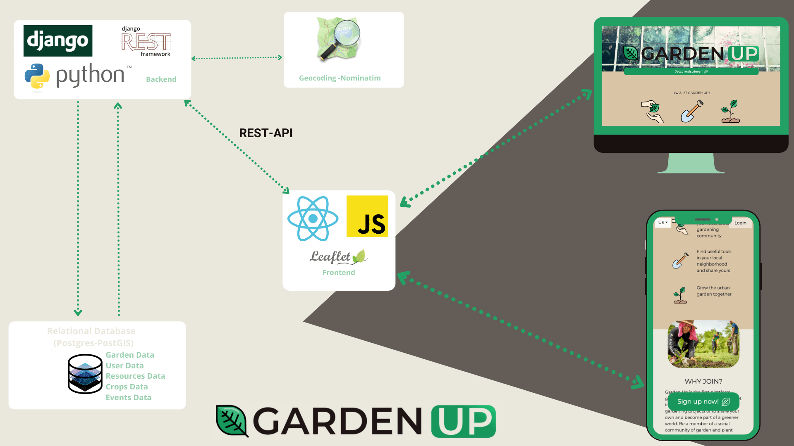
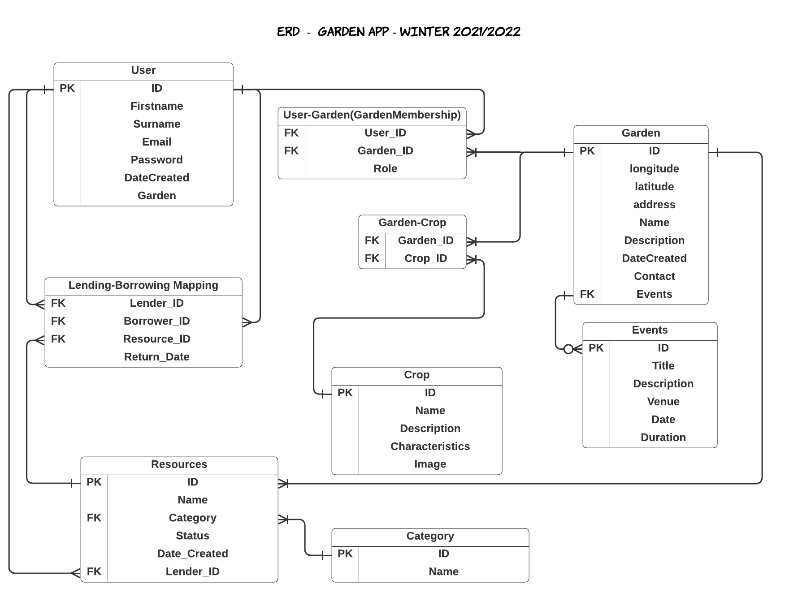
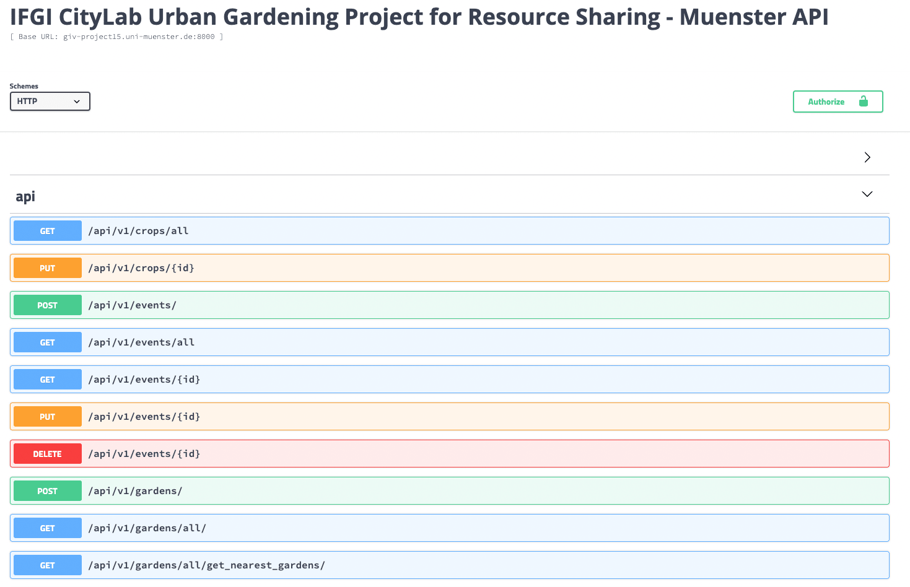

# Urban Gardening Backend Component (Garden Up Application)
This is the backend of the whole City Lab project at IFGI - University of Münster. The project was carried out by Brian Pondi, Javier Martin, Jonas Hurst, Nivedita Vee & Lukas Bäcker. 
The main purpose was to build an application that leads to the following benefits of urban gardening:
- Community collaboration
- Breaking social barriers
- Sustainability 
- Educate about produce 
- Healthy lifestyle

The Software achitecture overview is shown in the diagram below : 

The frontend codebase of this application can be found at:
- https://github.com/LukasBaecker/fe-stadtlabor-studyproject 

The Database Entity Relationship Diagram overview is shown in the diagram below : 

The backend part of the application was developed was developed in a Domain Driven Design and we can split it into :
- User Service
- Garden Service
- Resource Service
- Event Service
- Crop Service

## User Service 

User service data is stored in a Postgres instance. The service uses JWT for authentication. Users can be an Admin or a Member(s) of a Garden(s) Community(ies) . The passwords are stored in the Database encrypited using Secure Hash Algorithm(SHA-256).

Capabilities of the User service include apis to do the following :

- User Sign up
- User Log in and Log out
- User Forgot Password
- User Reset Password
- Get User details
- Update User details
- Find Gardens List that a User is part of

## Garden Service 

......

## Resource Service

......

## Event Service

......

## Crop Service

......

## API Documentation

The API documentation was done factoring in Open API specification standards, the url to the apis can be found here:
- http://giv-project15.uni-muenster.de:8000/

## Backend Deployment

The application can mainly be deployed in two ways i.e. Direct on a Linux Server or Using Containerization i.e. Docker.

....
### Linux Server

.....

### Docker 